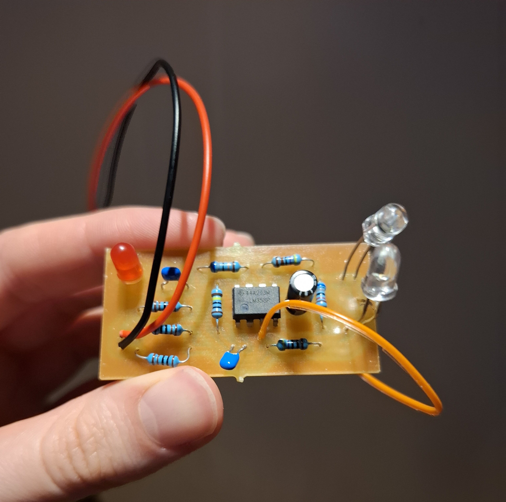
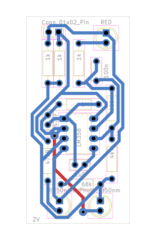

# Analog IR Pulse Sensor

A simple analog infrared pulse sensor based on reflective photoplethysmography (PPG).

The circuit uses an infrared LED and a photodiode to detect small changes in reflected light caused by blood volume changes in a fingertip. The signal is amplified and filtered using an LM358 operational amplifier.

## My work

The original circuit design was provided by the university as a reference.

I:

- recreated the circuit schematic in KiCad based on the provided design,
- designed the PCB layout in KiCad,
- prepared the single-sided board layout for CNC milling,
- manually assembled and soldered the board,
- brought the circuit into operation,
- tested the finished sensor.

## PCB design

The PCB was designed as a single-sided through-hole board suitable for CNC milling.

One crossing connection was implemented as a wire jumper.

A complete PCB layout export is available here:

[PCB layout PDF](exports/pcb_layout.pdf)

## Schematic

The original circuit design was provided by the university. I recreated the schematic in KiCad and used it as the basis for the PCB design.

A PDF version is available here:

[Schematic PDF](exports/schematic.pdf)

## Additional PCB exports

- [Bottom copper layer](exports/pcb_bottom_copper.pdf)
- [Top copper layer](exports/pcb_top_copper.pdf)

## Source files

The editable KiCad project files are available in the [`hardware`](hardware/) directory:

- `senzor_tepu.kicad_pro`
- `senzor_tepu.kicad_sch`
- `senzor_tepu.kicad_pcb`

## Acknowledgements

The original circuit design was provided by the Faculty of Electrical Engineering,
Czech Technical University in Prague (CTU FEL).
